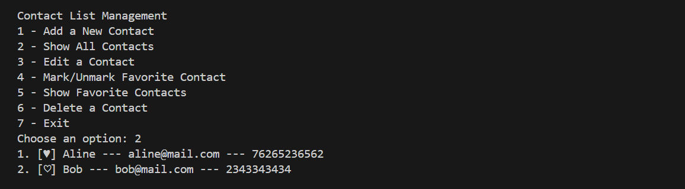

# Contact Manager CLI

A simple terminal-based contact manager application built in Python.  
Save, edit, delete, and favorite contacts directly from your terminal, following the concepts introduced in the **"Introdução ao Python"** module.

---

## Features

- Interactive menu to choose actions
- Add new contacts with:
  - Name
  - Phone
  - Email
  - Favorite status
- View all contacts
- Edit existing contacts
- Mark/unmark contacts as favorite
- List only favorite contacts
- Delete contacts

---

## How It Works

When the app starts, you’ll see a menu listing all available options.  
You can select what you want to do by typing the corresponding number.

## Run the application:

`python main.py`

## Run Tests:

`python test_contact.py`

---
